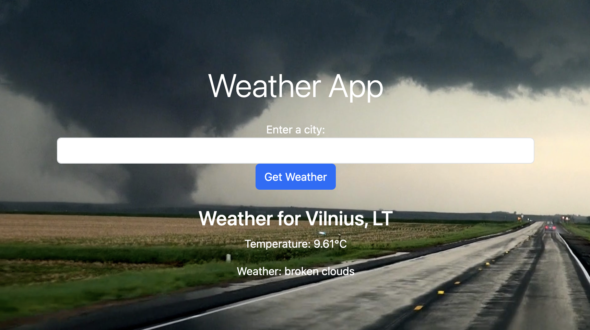

# Weather App
 A Flask web application for weather

<hr>
Home screen<br>

<hr>


## Initial Setup
<hr>

Clone repo and create a virtual environment
```
$ git clone https://github.com/giedriusstankauskas/weather-app.git
$ cd weather-app
$ python3 -m venv venv
$ . venv/bin/activate
```
Install dependencies
```
$ (venv) pip install -r requirements.txt
```

Start Flask app.
```
$ (venv) export FLASK_APP=app.py
$ (venv) flask run
```
